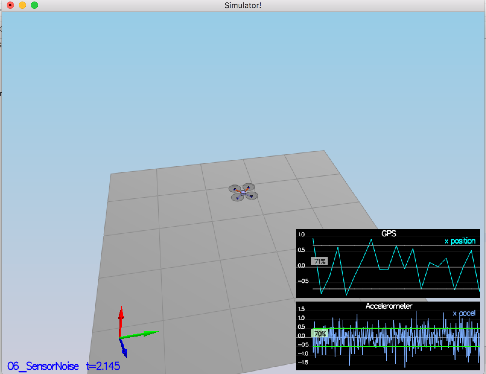
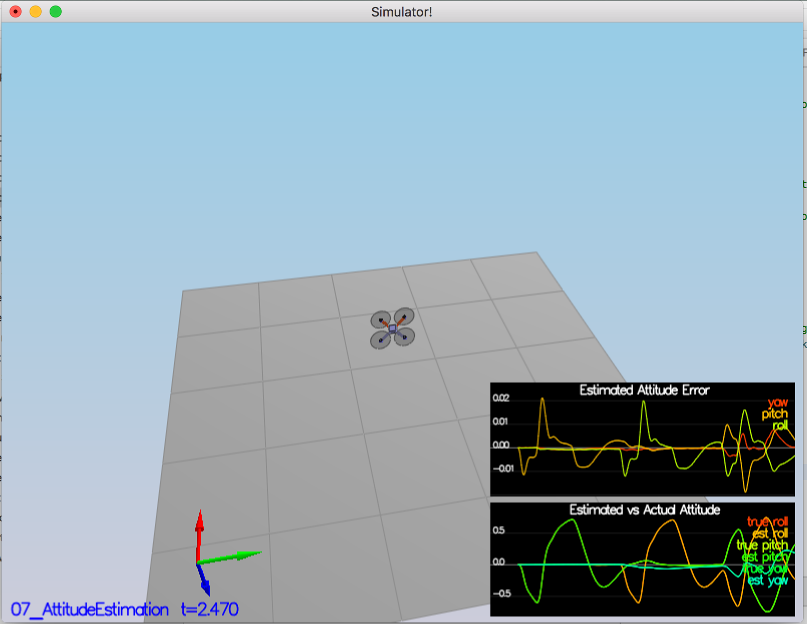
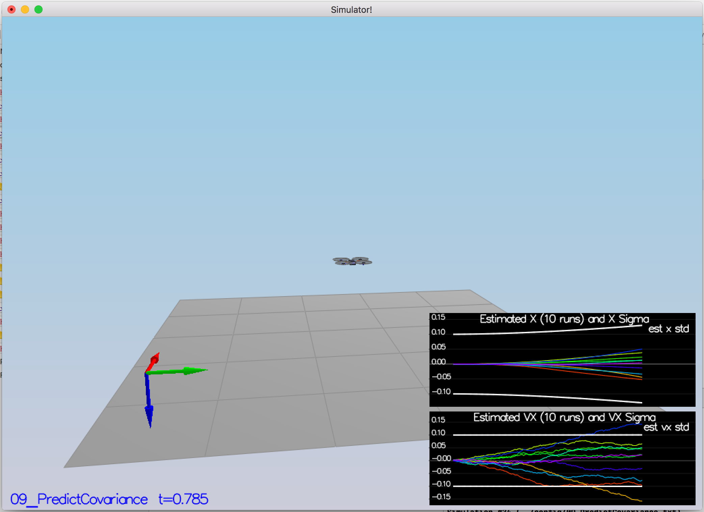
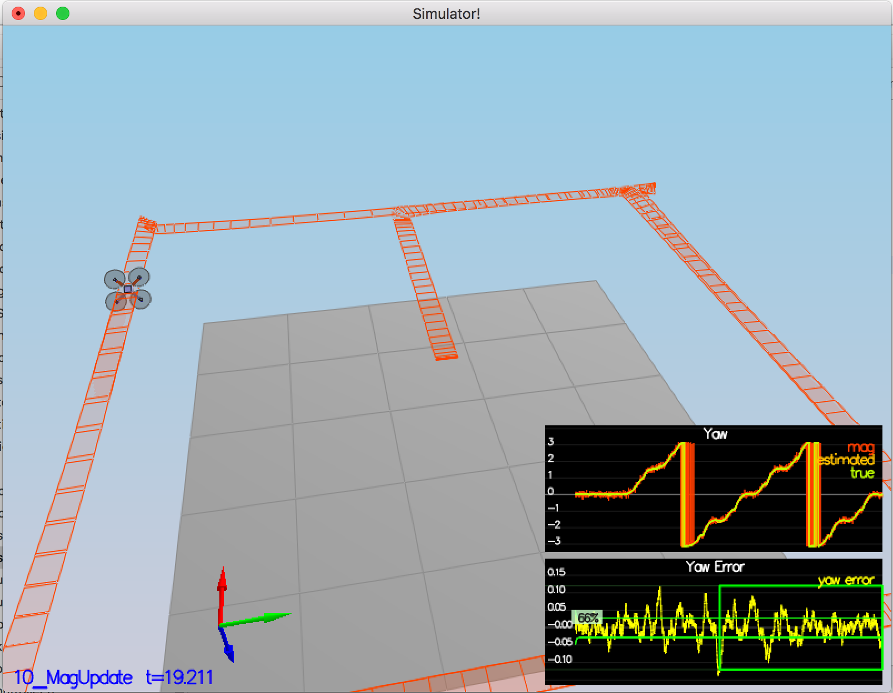

# Estimation Project #

This is the estimation portion of the controller used in the CPP simulator.The simulated quad will be flying with your estimator and your custom controller (from the previous project)!

#Tasks

## Step 1: Sensor Noise

After running the simulator in Xcode, logs were created inside config/logs folder. From the measured values, standard deviation of GPS and one accelerometer's x were calculated. 

> MeasuredStdDev_GPSPosXY = 0.7
> MeasuredStdDev_AccelXY = 0.51

These values seem to tally well with SimulatedSensors.txt values of 0.7 and 0.5

## Step 2: Attitude Estimation
In order to improve the gyro,use the non-linear Euler forward approach. FromEuler123_RPY is a handy method to convert current Euler estimates to a quaternion. Then IntegrateBodyRate is used to integerate the body rate. Finally, convert the quaternion back to new euler angle. Yaw may be normalized to lie in between -pi and pi. 

## Step 3: Prediction Step
 
This task has two sub-tasks:

a) Implement PredictState() which is essentially predicting for the state mean. 

   In this step using Rotate_BtoI() to rotate a vector from body frame to inertial frame  greatly simplfies the task of rotating a vector. 

b) Implement Predict which is essentailly the prediction of state covariance. 

   In this task, we use the PredictState to update the ekfState. Also, we use the EKF update equation to update the covariance as per:

>     ekfCov = gPrime * ekfCov * gPrime.transpose() + Q;
 
gPrime is the Jacobian and Q is a constant transition model covariance loaded from parameter file. 

## Step 4: Magnetometer Update

In this step, add magnetometer to improve the filter's performance in estimating the vehicle's heading. 

For first part, manually tuned the QYawStd parameter to .08 so that it approximately captures the magnitude of drift. 
The step is to calculate the difference of estimated Yaw from calculated yaw of magnetometer 

float diff = magYaw - ekfState(6);

and then use Update method to update the value of predicted yaw as per EKF update formula. 

## Step 5: Closed Loop + GPS Update
## Step 6: Adding Custom Controller

